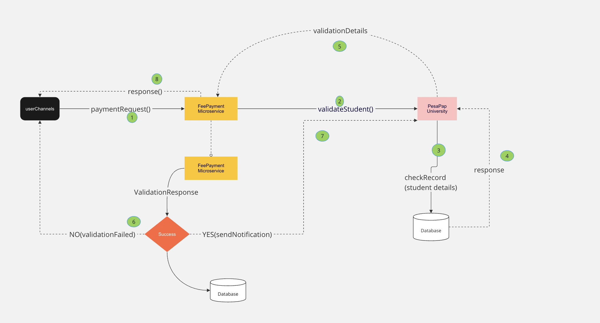

<h1>Integration</h1>
This documentation provide an overview of the integration point between Family Bank and Pesapap university.
The technology stack is Java 17, Spring boot and H2 database. Spring-boot Webflux is used to provide reactive non bolcking integration for scalability.
The two microservices leverage H2 as an embedded database and utilize the Spring WebFlux framework for building reactive applications.

H2 is a lightweight and fast in-memory database that allows us to store and retrieve data efficiently. In the context of the microservices, H2 is used as a data store to persist and query information.

The microservices are built using the Spring WebFlux framework, which provides a reactive programming model for handling HTTP requests and responses. With Spring WebFlux, we can create non-blocking, event-driven applications that can handle a large number of concurrent requests efficiently.

The microservices follow a RESTful architecture, exposing APIs that allow clients to interact with them. These APIs define the endpoints and operations that can be performed on the data stored in the H2 database.

By leveraging H2 and Spring WebFlux, the microservices can handle high loads and concurrent requests while maintaining responsiveness and scalability. The reactive nature of the framework enables efficient utilization of system resources and allows the microservices to handle multiple requests concurrently without blocking threads.

Overall, the combination of H2 as the embedded database and Spring WebFlux as the reactive framework provides a robust and efficient foundation for building scalable and responsive microservices.

# The design
>>High Level design 
The architecture consists of two microservices, fee-payment-ms and fee-notification-ms.
Each microservice has its own dedicated database: fee-payment-database for fee-payment-ms and fee-notification-database for fee-notification-ms.
The fee-payment-ms microservice handles payment-related operations and interactions with the fee-payment-database.
The fee-notification-ms microservice handles notification-related operations and interactions with the fee-notification-database.
The microservices communicate with their respective databases to perform CRUD operations, retrieve data, and update records.
The microservices can exchange information through REST API calls or message queues depending on the application's design.
Each microservice operates independently, managing its own data and business logic, providing loose coupling and scalability.

# System Architecture
Below diagram show the high level system architecture. 

</img>

# API Integration
<h3>How to get started [Docker registry] </h3>
To get started with pulling and running the fee-payment-microservice and fee-payment-notification images from Docker Hub, follow these steps:

Pull the fee-payment-microservice image:

docker pull reduser/fee-payment-microservice:latest
Run the fee-payment-microservice container:

docker run -d -p 9091:9091 reduser/fee-payment-microservice:latest
Pull the fee-payment-notification image:

docker pull reduser/fee-payment-notification:latest
Run the fee-payment-notification container:

docker run -d -p 9092:9092 reduser/fee-payment-notification:latest
Now, you have both microservices running as Docker containers on your local machine.

To test the fee-payment-microservice using Postman, you can send a POST request to the appropriate endpoint. Here's an example:

Endpoint: http://localhost:9091/api/payments
Method: POST
Body:
{
"paymentId": "abc123",
"studentId": 123,
"amount": 100.00,
"paymentDescription": "Payment for tuition fee",
"paymentMethod": "Mobile Money",
"paymentChannel": "Mobile Banking"
}

By following these steps, you can pull the Docker images, run the containers locally, and test the fee-payment-microservice using Postman.

<h3>Sample cURL request</h3>
<code>
curl --location 'http://localhost:9091/v1/api/student/notification' \
--header 'Content-Type: application/json' \
--data '{
"paymentId":"9a1a9e2c-ffc3-11ed-be56-0242ac120006",
"studentId": 1,
"amount": 18000.50,
"paymentDescription": "Test Fee Payment",
"paymentChannel": "online banking"
}
'
</code>

<h3>Sample logs [Bank microservice]</h3>

2023-06-02T12:44:43.834+03:00  INFO 48689 --- [nio-9090-exec-1] c.f.controllers.PaymentController        : Student validation response is complete
2023-06-02T12:44:43.834+03:00  INFO 48689 --- [nio-9090-exec-1] c.f.controllers.PaymentController        : ===Payment Request PaymentRequest{paymentId='9a1a9e2c-ffc3-11ed-be56-0242ac1200011', studentId=1, amount=1000.50, paymentDescription='Test Fee Payment', paymentMethod='Card Payment', paymentChannel='online banking', paymentDate=null}
2023-06-02T12:44:43.941+03:00  INFO 48689 --- [nio-9090-exec-1] c.f.s.FeePaymentNotificationService      : === RESPONSE RECEIVED[ {paymentId=9a1a9e2c-ffc3-11ed-be56-0242ac1200011, studentId=1, studentName=John Doe, amountPaid=1000.5, paymentDescription=Test Fee Payment}

<h3>Sample logs [Pesapap microservice]</h3>
2023-06-02T12:37:05.154+03:00  INFO 40617 --- [nio-9091-exec-7] c.p.services.StudentService              : ===VALIDATION REQUEST for :: 1
2023-06-02T12:37:05.154+03:00  INFO 40617 --- [nio-9091-exec-7] c.p.c.StudentValidationController        : === [Validation Response sent
2023-06-02T12:37:05.202+03:00  INFO 40617 --- [nio-9091-exec-3] c.p.services.StudentService              : ===[FEE_PAYMENT Notification Received :: FeePayment Details{paymentId=9a1a9e2c-ffc3-11ed-be56-0242ac1200011, studentId=1, amount=1000.50, paymentChannel='online banking', paymentDescription='Test Fee Payment', paymentDate=null}
